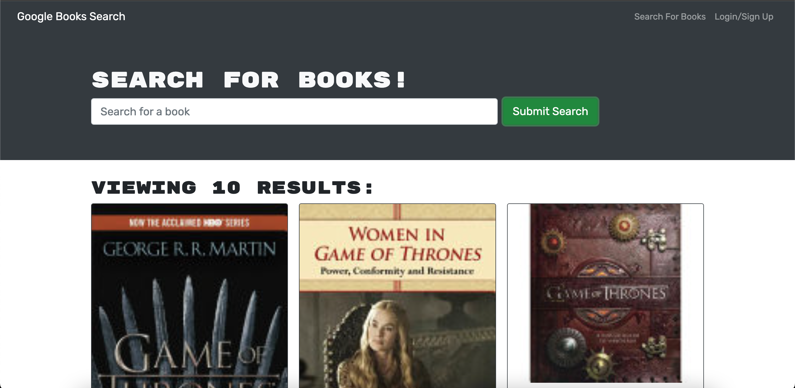
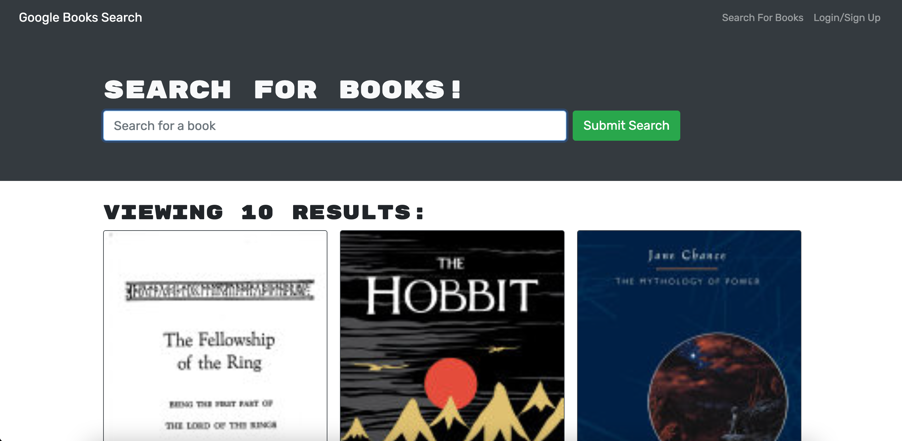

# Book Search Engine

## Description

The motivation of this project was create a database to search for books using Google Books API.

## Table of Contents
- [Installation](#installation)
- [Usage](#usage)
- [License](#license)
- [Contributing](#contributing)
- [Questions](#questions)

## Installation 

This project requires the following: browser to run application

## Usage 
Link to deployed application: [Book Search Engine](https://book-search-kate.herokuapp.com/)

(*Heroku link not working*)

## License 
BSD

  
  
  ## Contributing
  
  Created by [Katelyn King](https://github.com/katelynking)
  

  
  ## Questions
  
  GitHub username: [katelynking](https://github.com/katelynking)
  
  Email: katelynking112@gmail.com
  
  Please feel free to contact me with any questions.
